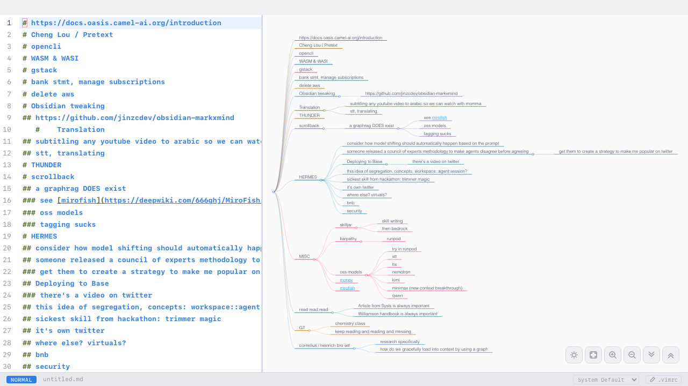

<div align="center">

# wd40

**A desktop mind mapping app that thinks in markdown.**

Write markdown on the left. Watch your mind map unfold on the right.

<br />



<br />
<br />

Built with [Tauri](https://tauri.app) + [Markmap](https://markmap.js.org) + [CodeMirror](https://codemirror.net)

---

</div>

### Features

- **Live mind map** --- headings become branches, updated as you type
- **Vim keybindings** --- modal editing built in
- **Google Fonts** --- pick any monospace font for editor and map
- **Native file I/O** --- open and save `.md` files directly
- **Fast** --- markdown parsing runs in Rust via Tauri

### Development

```sh
pnpm install
pnpm tauri dev
```

### Build

```sh
pnpm tauri build
```
