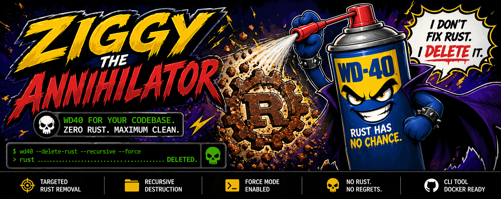

# wd40

<p align="center">
  
</p>

<p align="center">
  <strong>🦀 Zero Rust. Maximum Clean. 🦀</strong>
</p>

<p align="center">
  <a href="https://github.com/lmist/wd40/actions"></a>
  <a href="https://github.com/lmist/wd40/releases"></a>
  <a href="https://ziglang.org"></a>
  
  
</p>

---

## What the hell is this?

`wd40` is an **unhinged, zero-confirmation Rust annihilator** written in Zig. When it starts, it seizes your terminal, prints a sick ASCII banner, and recursively hunts down every trace of Rust on your machine—then **obliterates it without asking**.

No prompts. No `--force` flags. No survivors.

> *"I don't fix Rust. I delete it."* — Ziggy the Annihilator

## Features

- 🎯 **Terminal Hijack**: Clears the screen, hides the cursor, and splits the display into a static header (1/3) and a live scrolling log (2/3)
- 🔥 **Aggressive Scanning**: Recursively searches for `Cargo.toml`, `target/`, `.cargo`, `.rustup`, and known Rust binaries
- ⚡ **4 Worker Threads**: Parallel deletion queue for maximum carnage
- 🗑️ **Zero Confirmation**: Starts killing immediately. No questions asked.
- 🤬 **Random Insults**: Injects sporadic verbal abuse toward Rustaceans into the log stream
- 🐳 **Docker Proof of Concept**: Includes a Dockerfile that pre-installs Rust garbage, then `wd40`s it

## Quick Start

### Docker (Recommended — Safe Playground)

```bash
# Build the image (infests it with Rust, then arms wd40)
docker build -t wd40:latest .

# Run the chaos in an interactive terminal
docker run -it --rm wd40:latest
```

### Build from Source

```bash
# Requires Zig 0.13+
zig build -Doptimize=ReleaseFast

# Run at your own risk
./zig-out/bin/wd40
```

## What It Destroys

| Target | Description |
|--------|-------------|
| `~/.cargo` | Cargo registry, caches, installed binaries |
| `~/.rustup` | Rustup toolchains and metadata |
| `target/` | Build artifacts in any Rust project |
| `Cargo.toml` dirs | Entire project directories (source + build) |
| `rustc`, `cargo`, `rustup`, etc. | Rust binaries found in `$PATH` |
| `rustfmt`, `clippy-driver`, `rust-analyzer` | All the little friends too |

## Demo

```
     _      _     ___   ___
    | |    | |   |   | |   |
    | | ___| |___|___| |___|
    | |/ _ \ / __|___ \|___ \
    | |  __/ \__ \ ___) |__) |
    |_|\___|_|___/____/____/
         w i t h   w d 4 0   c a n

f u c k i n g   u p   a l l   t h e   r u s t   o n   t h e   m a c h i n e

VAPORIZED: 22 total (0 dirs, 0 files) | ERRORS: 2

[DELETED] /usr/local/cargo/bin/rustc
[DELETED] /usr/local/cargo/bin/cargo
[wd40] ferris wheel of destruction
[DELETED] /opt/demo/fd
[DELETED] /opt/demo/fd/target
[wd40] borrow this, bitch
[wd40] cargo? more like car-go-away

[wd40] MISSION ACCOMPLISHED. ALL RUST HAS BEEN OBLITERATED.
```

## ⚠️ Warning

This tool is **destructive by design**. It deletes files and directories permanently without confirmation. It is intended as a joke, a proof of concept, and a Docker-contained demonstration. **Do not run this on a machine where you care about your Rust projects.**

## License

WTFPL — Do whatever the fuck you want.

---

<p align="center">
  <em>Rust has no chance.</em>
</p>
